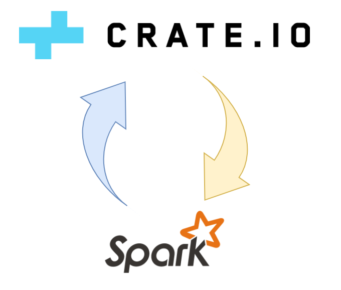
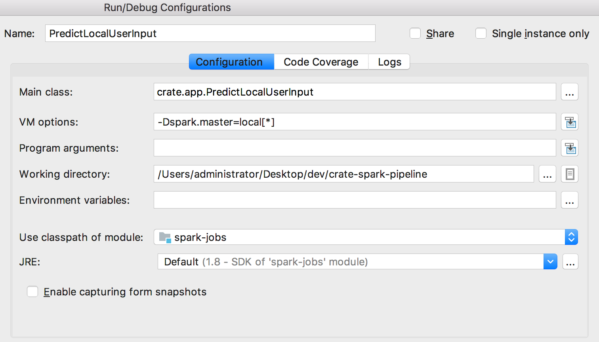
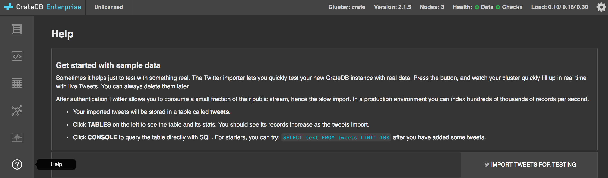

# Machine Learning with CrateDB and Apache Spark

## About

[CrateDB](http://crate.io) is a distributed SQL database that makes it simple to store and analyze massive amounts of machine data in real-time.

Features of CrateDB:

* Standard SQL plus dynamic schemas, queryable objects, geospatial features, time series data, first-class BLOB support, and realtime full-text search
* Horizontally scalable, highly available, and fault tolerant clusters that run very well in virtualized and containerised environments
* Extremely fast distributed query execution
* Auto-partitioning, auto-sharding, and auto-replication
* Self-healing and auto-rebalancing

CrateDB offers the scalability and flexibility typically associated with a NoSQL database and is designed to run on inexpensive commodity servers and can be deployed and run across any sort of network. From personal computers to multi-region hybrid clouds.

The smallest CrateDB clusters can easily ingest tens of thousands of records per second. And this data can be queried, ad-hoc, in parallel across the whole cluster in real time.

Though CrateDB is a pretty solid choice for managing Big Data, it was not built for advanced data processing that exceeds the capabilities of standard SQL.
This project overcomes those limitations by connecting CrateDB with Apache Spark.



[Apache Spark](http://spark.apache.org) is a cluster computing engine which offers lots and lots of various data operations.
All data operations could be run in a distributed way, where all computations are done in RAM if possible, which performs about 100x times faster than the previous Apache Hadoop system.
A really poplar feature of Spark is machine learning, which will mainly be covered here.

Since the theory may be complex at first sight, a simple use case helps to explain the theory behind.

### Use Case

Every solution starts with a problem.
In machine learning, a solution to a given problem is not hardcoded into a program which follows a bunch of rules to get to a result.
Instead, a machine learning algorithm is used to train a model which then takes care of solving problems.

Especially when trying to solve a problem using machine learning, it is a good idea to do some research about the situation beforehand.
This way it is easier to determine a suitable plan leading towards a good solution.
On the other hand it is also necessary to know if machine learning is even the right approach to solve this particular problem.

The following articles should give an idea of the problems which can be solved with this approach.

* [Top five Spark use cases](https://www.dezyre.com/article/top-5-apache-spark-use-cases/271)
* [Spark (notable) use cases](https://jaceklaskowski.gitbooks.io/mastering-apache-spark/exercises/spark-notable-use-cases.html)
* [Introduction to Apache Spark with Examples and Use Cases](https://www.toptal.com/spark/introduction-to-apache-spark)

---

To keep everything as simple as possible, this project takes care of a rather simple task: language identification.
The general idea of this process is to take some text as input and predict the possible language as output.

e.g. When entering "Today is a good day!" program should identify the text as english language.

After some research the language identification problem can be categorized as a [classification](https://en.wikipedia.org/wiki/Statistical_classification) problem.

### Requirements

To get your hands dirty on a project like this you will need:

* A CrateDB instance/cluster (tested with version 2.1.6)
* An Apache Spark instance/cluster (tested with version 2.2.0)
* A dataset which you want to use e.g. twitter tweets
* An idea what you want to accomplish with that dataset e.g. language identification of text
* Java 8
* Maven

### Use Case Setup

Please note that this project does not take care of everything needed for this use case automatically.
The following steps need to be performed manually:

* [Creation of the table `predicted_tweets`](#create-predicted-data-table)
* Creation of the spark-jobs.jar

## How to build the jar

The first step is to switch to the installation of the crate-spark-pipeline project.
Now do the following:   ``mvn clean package``

### Use Case Apps

This project contains four standalone apps which can be launched on Spark.
All apps are located in one project which can be packaged into one single jar file.
A sample usage how to launch each app and what they do is explained underneath.

The optional parameters are:

* ``--crate-host <crate-host>`` or shorter ``-c <crate-host>`` used for database connection (defaults to `localhost`)
* ``--http-port <http-port>`` or shorter ``-h <http-port>`` used for http communication with crate-host (defaults to `4200`)
* ``--psql-port <psql-port>`` or shorter ``-h <psql-port>`` used for psql communication with crate-host (defaults to `5432`)
* ``--user <crate-user>`` or shorter ``-u <crate-user>`` used for authentication for JDBC (defaults to `crate`)
* ``--driver <driver-class>`` or shorter ``-d <driver-class>`` used as JDBC driver class (defaults to "io.crate.client.jdbc.CrateDriver")

#### LearnFromTwitter

This app is able to create a language identification model based on Twitter data.
The Twitter data is received from a table named `tweets` inside CrateDB by using a JDBC connection String and a user to interact with CrateDB.
The model is then trained using these tweets and stored in a CrateDB BLOB table afterwards.
This model can then be further used in other applications to solve language identification problems.

#### PredictCrateData

PredictCrateData loads a language prediction model from a CrateDB BLOB table to predict all currently imported but unpredicted Tweets from CrateDB and stores the new data with predictions in a new `predicted_tweets` table.

#### LearnAndPredict

This class simply combines LearnFromTwitter and PredictCrateData.

#### PredictLocalUserInput

PredictLocalUserInput is an application which is launched at a local Spark instance. This is mainly for testing purposes.
The model is loaded from a CrateDB BLOB table.

#### Example usages

Launch LearnAndPredict locally with a local crate instance and a local relative model path using `spark-submit` on command line (Spark has to be installed).
This command has to be executed in the local spark installation.

``` bash
./bin/spark-submit --class crate.app.LearnAndPredict --master "local[*]" file:///tmp/crate-spark-pipeline/target/spark-jobs-1.0.jar
```

Launch PredictCrateData remotely with a remote crate instance using curl on command line (curl needs to be installed on the client, but Spark is not needed)
with a jar located on a http server

``` bash
`curl -X POST http://192.168.43.143:6066/v1/submissions/create --header "Content-Type:application/json;charset=UTF-8" --data '{
   "action" : "CreateSubmissionRequest",
   "appArgs" : [ ],
   "appResource" : "http://192.168.43.159:9000/spark-jobs-1.0.jar",
   "clientSparkVersion" : "2.2.0",
   "environmentVariables" : {
   "SPARK_ENV_LOADED" : "1"
 },
 "mainClass" : "crate.app.PredictCrateData",
 "sparkProperties" : {
     "spark.jars" : "",
     "spark.driver.supervise" : "false",
     "spark.app.name" : "MyRemoteClientJob",
     "spark.eventLog.enabled": "true",
     "spark.submit.deployMode" : "cluster",
     "spark.master" : "spark://192.168.43.143:6066"
 }
}'`
```

Launch PredictLocalUserInput locally with a local crate instance and a local local relative model path using IDE during development



### Use Case Queries

#### Create predicted data table

The following query creates a table to store predicted tweets:

``` sql
create table predicted_tweets (
 id string primary key,
 created_at timestamp not null,
 text string not null,
 prediction string not null,
 label string
)
```

Please note that the column `label` is optional, whether an evaluation query is executed or not.
For future use-cases, it would not make sense to include the solution to every column.
The solving should be the job of the machine learning model.

#### Evaluate predicted data (with label column only!)

The following query gives information about the quality of the model:

``` sql
select
    correct.c as correct,
    predicted.p as predicted,
    (correct.c::double/predicted.p::double*100.0) as percent_successrate
from
    (select count(*) as c from predicted_tweets where label=prediction) as correct,
    (select count(*) as p from predicted_tweets) as predicted
```

### Known Issues and Limits

For this project, it was not possible to solve every occuring problem at its source.
But for almost every known problem a workaround could be made. 
These problems may be fixed in future.

#### No automatic creation of tables from Spark

Since there is currently no CrateDB SQL Dialect implemented in JDBC it is not possible automatically create every table automatically.
Therefore, every table in which data shall be ingested via Sparks JDBC interface must be created manually.

The create table statements needed for this use case can be found in the section "Use Case Setup".

#### No streaming between CrateDB and Spark

At the moment writing this document it is not possible to create a streaming application due to following reasons:

* Spark does not yet support streaming via JDBC
* Sparks machine learning algorithms are currently not made for stream-based applications

One possible way to get around this issue is to fetch only data which has no predictions already.
This job needs to be executed at regular intervals then.

#### The language guesses for short sentences are not always correct

This occurs, when languages of training data are unevenly distributed.
If for example 90% of all training data is english, then all often occuring english n-grams are going to be heavier weighted than other languages.
The language guesses get better, if longer texts are used for identification.

## Guide

### Fetch/Ingest Data from/to CrateDB using Spark

At the moment of writing this document, [JDBC](https://crate.io/docs/clients/jdbc/) is probably the best way to connect CrateDB and Spark.

### Gathering Data

After the use case definition and some research, it's now time for the first real step in machine learning: gathering data.
Depending on the use case, data could either consist of sensor data produced by industry, social media data, stock prices or anonymised financial transactions.

For importing data, please refer to the [CrateDB documentation](https://crate.io/docs/crate/guide/index.html)

---

For this example, the used data are Twitter Tweets, which can be easily inserted into CrateDB by one click.
Note that the import of the data requires a Twitter account.

Simply navigate to Crate Admin UI (hostname:4200/#/help) and hit `import tweets for testing`.



After authorization, CrateDB will import a few tweet messages into a table named `tweets`.

### Preparing Data

In the beginning almost no dataset is in a usable format for a custom situation.
These datasets need some preparations beforehand.

When it comes to preparations, it is essential to identify the type of machine learning problem.
There are mainly two groups of machine learning methods:
Supervised and unsupervised machine learning. [Supervised ML](https://en.wikipedia.org/wiki/Supervised_learning) needs to know the correct answer of a given input,
while [unsupervised ML](https://en.wikipedia.org/wiki/Unsupervised_learning) does not need to have the correct answer.

Preparations depend on the state of the dataset:

* Does the dataset contain all the essential features or is some information missing?
* Is the data consistent or are there lots of errors and invalid data?

---

For this project the problem could be categorized as a multi-classification problem, which belongs to supervised machine learning.
So for training data, the problem and the correct solution needs to exist.
The desired state of the training data looks something like this:

``` table
+===========================+===========+
|text                       |language   |
+===========================+===========+
|Today is a good day!       |en         |
+---------------------------+-----------+
|Heute ist ein schöner Tag! |de         |
+---------------------------+-----------+
|...                        |...        |
+---------------------------+-----------+
```

But when having a look at the current state, the data may not look as it should:

``` table
+===========================================================================================================+
| text                                                                                                      |
+===========================================================================================================+
| @wachakonochi 出番、お疲れ様でした。                                                                         |
+-----------------------------------------------------------------------------------------------------------+
| RT @selma_topsakal3: #izmirescort https://t.co/hKoJriVH6k                                                 |
+-----------------------------------------------------------------------------------------------------------+
| RT @sweet_haribo: 갑자기 앨범 하나에서 세장의 포카가 후득 떨어졌다. 삼백현이었다. 올해 운 다 썼다. https://t.co/1XeW9fLRhY   |
+-----------------------------------------------------------------------------------------------------------+
| RT @marcorubio: For all of S.Fla, all preparations evacuations should be COMPLETED by sunset on Friday.   |
+-----------------------------------------------------------------------------------------------------------+
| posição 20115 no Ranking segue-de-volta. Confira os 100 primeiros: https://t.co/VhYsyMzBHF. #1 @asciiART  |
+-----------------------------------------------------------------------------------------------------------+
| #chibalotte                                                                                               |
+-----------------------------------------------------------------------------------------------------------+
| رفرف على #الحد_الجنوب                                                                                     |
+-----------------------------------------------------------------------------------------------------------+
| 😆😆😆                                                                                                     |
+-----------------------------------------------------------------------------------------------------------+
```

To get from current to the desired state the data needs to be cleaned, filtered, and labeled.
These operations can be done by using transformations in Spark.

#### Transformations

A [transformation](https://spark.apache.org/docs/latest/ml-pipeline.html#main-concepts-in-pipelines) is basically the process of adding, editing, removing, combining parts of
one or more column(s) of a dataset and storing the outcome in a new column.
Transformations are applied in their defined order on all rows of a dataset.

Spark already provides a good amount of [transformer tools](http://spark.apache.org/docs/latest/ml-features.html) to manipulate data towards a format that is usable in machine learning.
Spark also offers an [interface to implement a custom transformer](https://spark.apache.org/docs/latest/api/java/org/apache/spark/ml/UnaryTransformer.html) if none of the tools can do the job.

---

When having a look at the raw twitter data there are some segments of `text` which don't provide usable information for language detection.
These segments are dropped:

* the '`RT @username:`' of retweets
* other user mentionings e.g. '`@username`'
* Hashtags
* E-mail-addresses
* URIs
* Emojis 😋😉

To provide reliable texts to the language detection algorithm, it is also recommended to set a minimum text length.
After these transformations the training data is almost prepared and ready for machine learning.

#### Labeling

This step is only necessary for supervised machine learning and can be skipped when using unsupervised machine learning.
To solve a problem in a supervised machine learning method, the solution to a problem has to exist.
In terms of machine learning, the solution of a given problem is called [label](https://stackoverflow.com/a/40899529).

---

A label is still missing in the current training data.
An easy way to provide the label for this use case is the usage of a [language detection library](https://github.com/shuyo/language-detection), which is used in a custom transformer.
After this step, the training data has the desired format.

#### Feature preparation

As soon as the data is in the desired state, the next step is to prepare the input data for machine learning.  
[Features](https://stackoverflow.com/a/40899529) are one or more characteristics of a situation which are used as input parameters of machine learning.
After training a model, this model tries to use the features of unknown problems to get to a solution.

For machine learning, features are usually a set of numbers.
But if the current features are texts, a few steps are going to be needed to get to numbers.

##### Tokenizer + N-Gram

[Tokenization](https://en.wikipedia.org/wiki/Lexical_analysis#Tokenization) in terms of language processing is the process of splitting text into smaller segments.
These segments can either be words, silblings, sentences or single characters (whitespace included).

---

The first language identification approach which comes to peoples minds is the learning of every word in every language.
This is a bad approach since there are a lot of words. A better method (which is used here) is the usage of n-grams.
[Read more about this approach](http://cloudmark.github.io/Language-Detection/).

For this project, the text will be split into lowercase characters, which are then re-combined to groups of size n, where n is a numeric value.
These groups are then used further. 

##### HashingTF

Unfortunately, Spark is not capable of machine learning using texts.
These texts need to be transformed into numbers, where the easiest way is the use of a hashing function.

##### Label preparation

Since Spark can only apply machine learning on numeric values, the labels need to be numeric.
Fortunately, Spark offers a convenient way to map text-labels to numeric values and back.

###### String Indexer

Produces a model which automatically maps every text to a identifiable index.
The human readable texts are stored and can be reused for re-converting results.

###### Index To String

Converts indices back to a human readable text. This transformer is usually applied on predictions.
When using this transformer, it is essential to know the labels which were used.
A String Indexer Model provides these.

### Choosing a Model

The next step is choosing a model.
There are many models that researchers and data scientists have created over the years.
Some are very well suited for image data, others for sequences (like text, or music), some for numerical data, others for text-based data.

These two articles give a good overview to get started:

* [How to choose algorithms for Microsoft Azure Machine Learning](https://docs.microsoft.com/en-us/azure/machine-learning/machine-learning-algorithm-choice)
* [Essentials of Machine Learning Algorithms](https://www.analyticsvidhya.com/blog/2015/08/common-machine-learning-algorithms/)

If there are still doubts regarding a suiting machine learning algorithm, some experiments can be made.

---

After running some experiments, [the results](https://docs.google.com/spreadsheets/d/1IdbGhvVd2GMRGay1ujecE5SLtt76IbxE_kG-tArEG2Q/edit?usp=sharing) show that Naive Bayes seems to be a good and well performing solution for this use case.

### Pipelining

Now that all essential components are defined, everything can be put together.
The result is a [pipeline](http://spark.apache.org/docs/latest/ml-pipeline.html).
This pipeline consists of an ordered list of transformations and estimatiors (model-producing-components), which can be applied on the dataset. 

---

Since the machine learning model should be capable of identifying any text, it does not make sense to include every step of the preparation of the training data.
For this use case, the acually performed steps start from the point where the training data preparation is in the desired state:

* Tokenizer (split on character basis and put all lowercase)
* N-Gram (build groups of characters of size n)
* Hashing Transformation Function (convert the n-grams to numeric features)
* Naive Bayes (predict language index using numeric features)
* Index To String (convert predicted language index to set of language values)

### Training

Now its time to move onto what is often considered the bulk of machine learning — the training.
In this step, the pipeline tries to create a model which incrementally improves its ability to predict the solution.

In Spark, the function to train a model on a specific training dataset is called `fit` where the result is the representing model,
which fits best with the current configuration on the corresponding training data.

### Evaluation

Once the training is complete, it’s time to see if the model is any good, using Evaluation.
Evaluation allows us to test our model against data that has never been used for training.
This metric allows us to see how the model might perform against data that it has not yet seen.
This is meant to be representative of how the model might perform in the real world.

In this process, the prediction from the newly trained model is compared to the label from the training data.
The amount of correct predictions divided by the total amount gives a score to evaluate.

Usually, the prepared dataset from the start has about 80% of the data reserved for training, and the last 20% for evaluation.
Spark takes care of that for us already in the next section.

Depending on the machine learning problem, a suitable [Evaluator](http://spark.apache.org/docs/latest/api/scala/index.html#org.apache.spark.ml.evaluation.Evaluator) has to be used.

---

For this multi-classification problem the usage of a [MulticlassClassificationEvaluator](http://spark.apache.org/docs/latest/api/scala/index.html#org.apache.spark.ml.evaluation.MulticlassClassificationEvaluator) seems appropriate.

### Parameter Tuning

Once evaluation is done, it’s possible to further improve the evaluations score of the pipeline by variating configuration parameters.

In Spark, this can be done using a [CrossValidator](http://spark.apache.org/docs/latest/ml-tuning.html#cross-validation).
A CrossValidator accepts a set of settings of pipeline components, which can be combined in every way to produce the best model for this problem.

Note that all steps in the pipeline are executed in every possible given combination.
This may take a really long time when defining too many different parameters.

---

For this project, after running some experiments, [the results](https://docs.google.com/spreadsheets/d/1IdbGhvVd2GMRGay1ujecE5SLtt76IbxE_kG-tArEG2Q/edit?usp=sharing) show that some transformer settings worked better than others.
The few settings depending on the input data are used as variable parameters for tuning.
These are:

* N-Grams size n (varying from 3 to 4)
* Hashing TFs number of features (varying from 20k over 25k to 30k)

### Prediction

Machine learning is using data to answer questions.
So Prediction, or inference, is the step where a model gets to answer questions.
This is the point of all this work, where the value of machine learning is realized.

To predict any given dataset, the resulting models `transform` function applies its predictions on the dataset.

### Persisting progress of Spark in CrateDB

When it comes to persistence, Spark offers the opportunity to persist current progress in case of reuse at a later time.
With a little workaround, also distributed Spark objects implementing java.io.Serializable like machine learning models can be persisted in CrateDB using BLOB functionality.
To see how it's done, please have a look at [CrateBlobRepository.java](src/main/java/crate/util/CrateBlobRepository.java)
